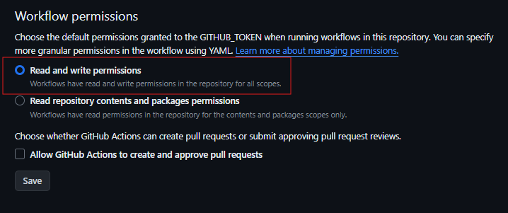
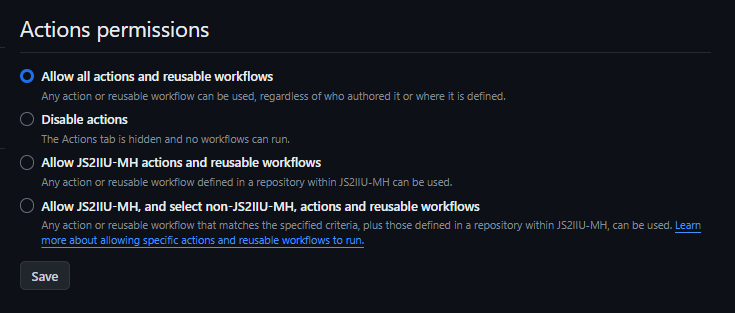

# reuse_wf
Reusable Github workflow


[](LICENSE)

## Github workflowの再利用
- 異なるリポジトリでの共通のworkflow管理を簡略化するために、本リポジトリのymlファイルを参照してworkflowを流すことを試しています。
- このリポジトリでは`flake8`によるコードチェックを異なるPythonバージョンで実行させるActionと、このページの上のほうにあるBYOBバッジ（flake8/passingのバッジ）を生成するActionを走らせるサンプルを公開しています。
- ~~同じリポジトリ内では正しく動作することを確認しておりますが、別リポジトリからの実行は確認できておりません。~~
- BYOBバッジの設置についてはこの`README.md`のソースを参照してください。
    ```raw
    
    
    ```

| ファイル        | 内容 | Workflow | 
| --------------- | ---- | --- | 
| [`.github\workflows\re_flake8.yml`](.github\workflows\re_flake8.yml)   | 呼び出されるymlファイル | push時にいくつかのPythonバージョンでflake8テストを実行。リポジトリ内すべての*.pyファイルが対象。テスト状況をREADMEのBYOBバッジで表示する。 | 
| [`.github\workflows\call_flake8.yml`](.github\workflows\call_flake8.yml) | 呼び出す側のymlファイル | このファイルを呼び出す側のリポジトリに設置する。`./github/workflow/`の下に。~~おそらくこのファイルを置くだけで良いはず。~~ | 
| [`.github\actions\create_env_cache\action.yml`](.github\actions\create_env_cache\action.yml) | Actionの設定ファイル | `.github\actions\create_env_cache\`以下に配置してください。Actionsの実行を高速化するためキャッシュを生成します。 | 

## 対象リポジトリの設定
- 呼び出し側リポジトリの一番上の階層に`requirements.txt`を置いてください。Actionsの実行に必要です。仮想環境を使われている方は問題ないと思いますが、仮想環境を使わずに開発されている場合でいろいろインストールしているとActionsの実行に時間がかかる場合があります。
- 呼び出し側リポジトリの[Setting]-[Actions]-[General]の設定で[Workflow permissions]を確認してください。Read and write permissionsにチェックしているか確認してください。この設定がされていないとActionがうまく動きません。

  

- Read and write permissionsを設定してもダメな場合は、同じ[General]の設定の[Actions permissions]を確認してください。Allow all actions and reusable workflowsを選択してください。デフォルトではDisable actionsになっているかもしれません。

  

## Reference
- [ワークフローの再利用 - GitHub Docs](https://docs.github.com/ja/actions/using-workflows/reusing-workflows)
- [Check! GitHub Actions 再利用可能なワークフローのポイントを抑える](https://zenn.dev/dzeyelid/articles/fc4bd999fbccd8)
- [GitHub Actions の「ワークフローの再利用」をプライベートリポジトリで使う - kakakakakku blog](https://kakakakakku.hatenablog.com/entry/2023/01/10/081119)